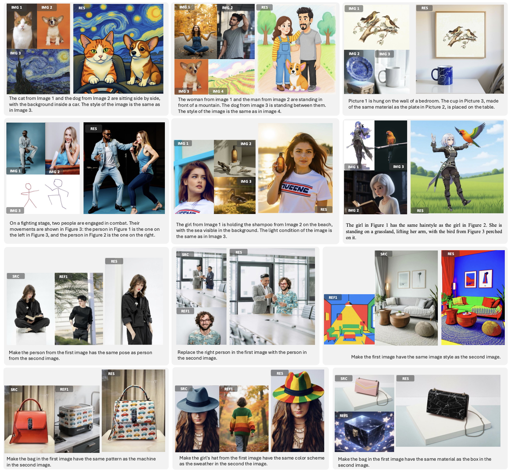
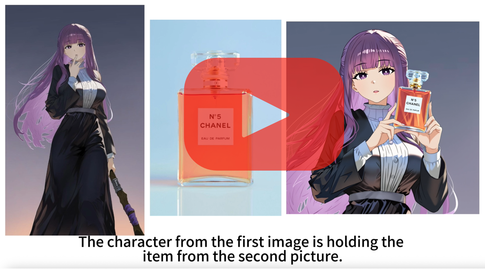

# DreamOmni2: Multimodal Instruction-based Editing and Generation

<p align="center">
    <a href="https://arxiv.org/html/2510.06679v1">
            
    </a>
    <a href="https://pbihao.github.io/projects/DreamOmni2/index.html">
        
    </a>
    <a href="https://www.youtube.com/watch?v=8xpoiRK57uU">
        
    </a>
    <a href="https://huggingface.co/datasets/xiabs/DreamOmni2Bench">
        
    </a>
    <a href="https://huggingface.co/xiabs/DreamOmni2">
        
    </a>    
    <a href="https://huggingface.co/spaces/wcy1122/DreamOmni2-Edit">
        
    </a>
    <a href="https://huggingface.co/spaces/wcy1122/DreamOmni2-Gen">
        
    </a>
    <a href="https://www.runninghub.ai/workflow/1980131298238959618">
        
    </a>
</p>

## 🔥 News
- 🔥**2025.10.10**: Release DreamOmni2 [editing demo](https://huggingface.co/spaces/wcy1122/DreamOmni2-Edit) and [generation demo](https://huggingface.co/spaces/wcy1122/DreamOmni2-Gen)
- 🔥**2025.10.10**: Release DreamOmni2 [Benchmark](https://huggingface.co/datasets/xiabs/DreamOmni2Bench).
- 🔥**2025.10.10**: Release DreamOmni2's [codes](https://github.com/dvlab-research/DreamOmni2) and [models](https://huggingface.co/xiabs/DreamOmni2).
- 🔥**2025.10.09**: Release DreamOmni2 [tech report](https://arxiv.org/html/2510.06679v1).


<p align="center">
  
</p>


<div align="center">
  <a href="https://cloud.video.taobao.com/vod/HxWB8i8sYkh0DdfvfByoMHqRtezNMCpWJdjzWTOCqdY.mp4">
    
  </a>
</div>


## Introduction

**(1) Multimodal Instruction-based Generation**

For traditional subject-driven generation based on concrete objects, DreamOmni2 achieves the best results among open-source models, showing superior identity and pose consistency. Additionally, DreamOmni2 can reference abstract attributes (such as material, texture, makeup, hairstyle, posture, design style, artistic style, etc.), even surpassing commercial models in this area.

**(2) Multimodal Instruction-based Editing**

Beyond traditional instruction-based editing models, DreamOmni2 supports multimodal instruction editing. In everyday editing tasks, there are often elements that are difficult to describe purely with language and require reference images. Our model addresses this need, supporting references to any concrete objects and abstract attributes, with performance comparable to commercial models.

**(3) Unified Generation and Editing Model**

Building upon these two new tasks, we introduce DreamOmni2, which is capable of multimodal instruction-based editing and generation under any concrete or abstract concept guidance. Overall, DreamOmni2 is a more intelligent and powerful open-sourced unified generation and editing model, offering enhanced capabilities across a wide range of tasks.

## Editing and Generation Model?
Editing and generation are distinct tasks. Editing requires strict consistency in preserving the non-edited areas of the source image, while generation only needs to retain the ID, IP, or attribution from the reference image as per the instructions, allowing the entire image to be regenerated with a focus on aesthetics. We’ve found that the instructions for generation and editing are often similar, so we’ve separated these two tasks to make it easier for users to choose the appropriate task type.

## Quick Start

### Requirements and Installation

First, install the necessary dependencies:
```bash
git clone https://github.com/dvlab-research/DreamOmni2
cd ./DreamOmni2
pip install -r requirements.txt
```

Next, download the DreamOmni2 weights into the models folder.

```bash
huggingface-cli download --resume-download --local-dir-use-symlinks False xiabs/DreamOmni2 --local-dir ./models
```

### Inference

Multimodal Instriction-based Editing

**Notably, for editing tasks, due to the format settings of the training data, we need to place the image to be edited in the first position.**

```bash
python3 /mnt/bn/unifygen/xiabin_dev/iclr2026/DreamOmni2/inference_edit.py \
    --input_img_path "example_input/edit_tests/src.jpg" "example_input/edit_tests/ref.jpg" \
    --input_instruction "Make the woman from the second image stand on the road in the first image." \
    --output_path "example_input/edit_tests/edit_res.png"
```

Multimodal Instriction-based Generation
```bash
python3 /mnt/bn/unifygen/xiabin_dev/iclr2026/DreamOmni2/inference_gen.py \
    --input_img_path "example_input/gen_tests/img1.jpg" "example_input/gen_tests/img2.jpg" \
    --input_instruction "In the scene, the character from the first image stands on the left, and the character from the second image stands on the right. They are shaking hands against the backdrop of a spaceship interior." \
    --output_path "example_input/gen_tests/gen_res.png" \
    --height 1024 \
    --width 1024
```


### Web Demo
```
CUDA_VISIBLE_DEVICES=0 python web_edit.py \
    --vlm_path PATH_TO_VLM \
    --edit_lora_path PATH_TO_DEIT_LORA \
    --server_name "0.0.0.0" \
    --server_port 7860


CUDA_VISIBLE_DEVICES=1 python web_generate.py \
    --vlm_path PATH_TO_VLM \
    --gen_lora_path PATH_TO_GENERATION_LORA \
    --server_name "0.0.0.0" \
    --server_port 7861
```


## Disclaimer

This project strives to impact the domain of AI-driven image generation positively. Users are granted the freedom to
create images using this tool, but they are expected to comply with local laws and utilize it responsibly.
The developers do not assume any responsibility for potential misuse by users.


##  Citation

If DreamOmni2 is helpful, please help to ⭐ the repo.

If you find this project useful for your research, please consider citing our [paper](https://arxiv.org/html/2510.06679v1).

## Contact
If you have any comments or questions, please [open a new issue](https://github.com/xxx/xxx/issues/new/choose) or contact [Bin Xia](zjbinxia@gmail.com).


